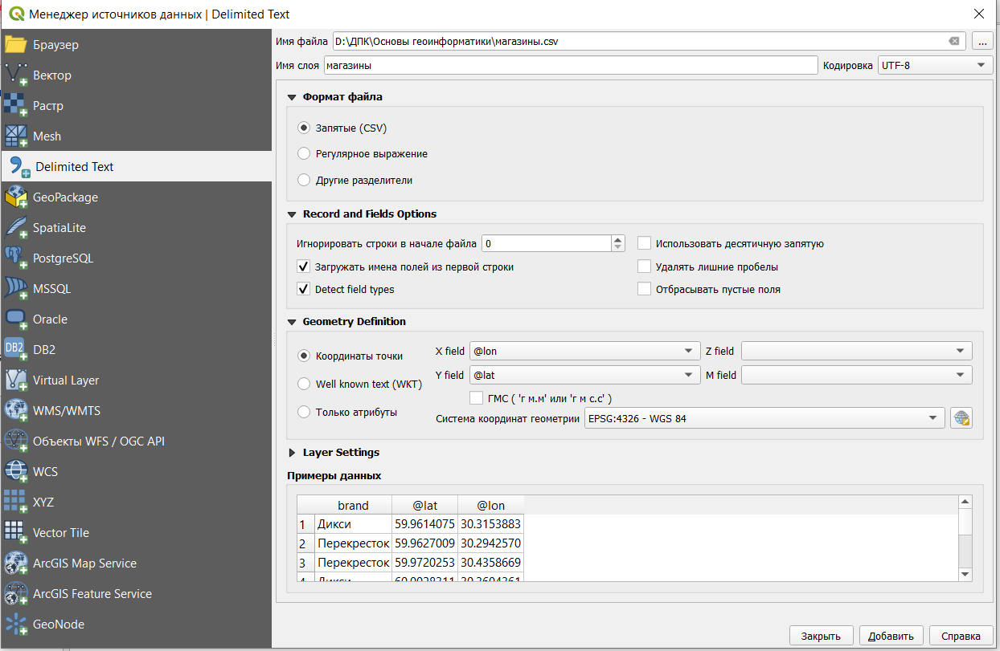

# Создание карты и редактирование стиля {#basics}

## Добавление объектов на карту

После запуска программы нужно создать новый проект, в котором будут храниться все файлы с добавленными слоями, стилями и макетами.

Новый проект будет выглядеть так.


Сверху находится строка меню и основная панель инструментов, слева 2 панели: Браузер (здесь отображаются все доступные источники данных) и Слои (здесь будут отображаться все добавленные в проект слои с данными.

Чтобы добавить новый слой из документа в формате csv, нужно в строке меню выбрать **Слой ⤑Добавить слой⤑Добавить слой из текста с разделителями**.


Далее к открывшемся диалоговом окне нужно выбрать файл и установить необходимые настройки



Так как координаты объектов в нашем случае заданы широтой и долготой, то необходимо выбрать систему координат `EPSG:4326 - WGS 84` (про системы координат чуть подробнее будет позже) с координатой X - долготой и координатой Y - широтой.

В результате на карте должны появиться точки, нанесенные по координатам.


Добавим на карту подложку с OpenStreetMap. Она уже содержится в программе по умолчанию, ее можно найти в панели Браузер под названием XYZ Tiles. Чтобы добавить подложку достаточно просто дважды кликнуть по ней.


Кроме подложки по умолчанию, можно подключить дополнительные тайлы. Для этого нужно щеклнуть правой кнопкой мыши на XYZ Tiles и выбрать пункт *Подключить*. Далее в диалоговом окне обязательно нужно указать имя подключения и ссылку. Можно воспользоваться подложками Google по следуюшим ссылкам:

-   карта улиц и дорог [[http://mt0.google.com/vt/lyrs=m&hl=en&x={x}&y={y}&z={z}]{.ul}](#sent/_blank)

-   рельеф [http://mt0.google.com/vt/lyrs=p&hl=en&x={x}&y={y}&z={z}](#sent/_blank)

-   модифицированная карта улиц и дорог [http://mt0.google.com/vt/lyrs=r&hl=en&x={x}&y={y}&z={z}](#sent/_blank)

-   только спутниковое изображение[http://mt0.google.com/vt/lyrs=s&hl=en&x={x}&y={y}&z={z}](#sent/_blank)

-   только рельеф [http://mt0.google.com/vt/lyrs=t&hl=en&x={x}&y={y}&z={z}](#sent/_blank)

-   гибридное изображение [http://mt0.google.com/vt/lyrs=y&hl=en&x={x}&y={y}&z={z}](#sent/_blank)

Также подложку можно добавить с помощью модуля *QuickMapServices*. Этот модуль нужно предварительно установить с помощью команды из строки меню **«Модули»→Управление модулями**, далее в открывшемся диалоговом окне в строке поиска набрать название модуля и после нахождения модуля, нажать Установить (Install).

После установки модуля на панели инструментов появятся две кнопки, с помощью которых можно добавлять в проект подложки из различных сервисов.

Если ранее добавленные точки пропали с карты, нужно просто перетащить их в перечне слоев над подложкой.

Как можно видеть изображение находится как бы под углом. Это объясняется системой координат, установленной по умолчанию. Сделаем перепроецирование карты. Для этого нужно в правом нижнем углу нажать на обозначение системы координат `EPSG:4326 - WGS 84` и далее в открывшемся окне выбрать систему координат `EPSG:3857 - WGS 84 / Pseudo Mercator.`


Полученный результат будет выглядеть для нас более "привычным". Это объясняется тем, что мы выбрали наиболее широко применяемую систему координат в мире: ту, которая используется во всех веб-картах (Google Maps, Yandex и прочие).


> Важно помнить, что это "перепроецирование на лету", которое меняет только отображение данных на карте, проекции слоев остаются в этом случае неизменными. Чтобы изменить проекцию конкретного слоя следует пользоваться инструментом *Перепроецировать слой* из панели инструментов анализа

## Системы координат

При подготовке любых карт одна из самых сложных и важных задач - это подбор правильной проекции. Проекция - это способ отображения поверхности Земли на плоскости.

От выбора проекции зависит степень искажения размеров, длин и углов. Есть мнение, что проекции создают нашу картину мира, о чем есть великий эпизод из сериала West Wing.

```{=html}
<iframe width="800" height="400" src="https://www.youtube.com/embed/vVX-PrBRtTY" title="YouTube video player" frameborder="0" allow="accelerometer; autoplay; clipboard-write; encrypted-media; gyroscope; picture-in-picture" allowfullscreen></iframe>
```
Также про проекции есть выпуск веб-комикса [xkcd](https://xkcd.com/977/).


Как уже было сказано чуть выше самой распространенной проекцией, с которой большинство из нас сталкивается практически ежедневно, является `EPSG:3857 - WGS 84 / Pseudo Mercator.` В этой проекции очень велики искажения размеров, особенно в приполярных областях, так как она является цилиндрической. То есть при ее создании земной шар помещается внутрь цилиндра, который соприкасается с ним на экваторе, после чего все проецируется на поверхность цилиндра и он разворачивается на плоскость.

Посмотреть, насколько искажаются размеры в привычной нам проекции можно на сайте [The True Size ...](https://thetruesize.com/)

Но в ГИС все не ограничивается только способом проецирования на плоскость, также важно как и задаются оси координат, где находится начало системы координат, какие единицы измерения используются, каков охват системы координат. Поэтому в ГИС говорят не просто о проекции, а о системе координат - **coordinate reference system или crs**.

Сейчас используется единая классификация систем координат в ГИС - реестр EPSG, с которым можно ознакомиться на сайте [epsg.io](epsg.io).

Все имеющиеся в реестре системы координат уже заданы в QGIS, а также есть возможность создания пользовательских систем координат. При создании пользовательской системы координат можно составить ее описание в формате **WKT** (well-known text) или в формате **proj.**

Для подбора подходящей системы координат можно воспользоваться сервисом [Projection wizard](http://projectionwizard.org/).

> Следует помнить, что существует два основных типа систем координат: географические и прямоугольные (спроецированные). В первых в качестве единиц измерения используются градусы, а во вторых - метрические единицы. Это имеет значение при ряде операций пространственного анализа.

## Настройка стиля слоя

Для того, чтобы настроить стиль слоя, нужно открыть его свойства. Это делается либо двойным щелчком по названию слоя, либо через контекстное меню, вызываемое щелчком правой кнопки мыши по названию слоя.

По умолчанию стиль слоя с точечными объектами задается как *Обычный знак*.


Другие доступные варианты


-   уникальные значения - как правило, используется для категориальной или дискретной переменной с небольшим количеством значений;

-   градуированный знак - для задания символа в зависимости от числовой переменной;

-   правила - позволяет задавать символику на основе выражения;

-   смещение точек - позволяет показать все точки слоя, даже если они находятся в одном месте, возможны варианты смещения по кругу, концетрическим кругам и сетке;

-   point cluster - собирает близко расположенные точечные объекты в один;

-   создание теплокарт - создает динамическую карту плотности распределения объектов.

Для линейных и площадных объектов настройки стиля будут аналогичны, но не полностью.

Так как в нашем датасете содержится информация о сетевых магазинах самый простой способ стилизовать слой - это уникальные значение по названиям сетей.


После изменения стиля точки станут отображаться на карте с его учетом, а также появится легенда слоя.


Цвета и типы символов можно настраивать дополнительно вручную.\
Тепловая карта объектов будет выглядеть примерно таким образом, но важно помнить, что она динамически пересчитывается в зависимости от масштаба.


В QGIS описание стиля слоя можно сохранить в формате xml, что позволяет обмениваться стилями оформления  и применять готовые стили.

Чтобы использовать готовый стиль, нужно скачать файл стиля (например, с ресурса [http://qgis-hub.fast-page.org/styles.php).](http://qgis-hub.fast-page.org/styles.php).) После этого нужно выбрать *Управление стилями* в свойствах слоя.

Далее нужно выбрать Импорт/Экспорт→Импорт и выбрать файл с описанием стиля, после чего импортировать его.
