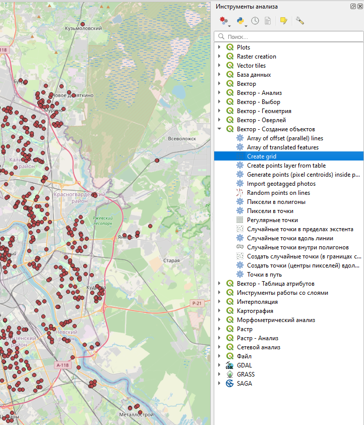
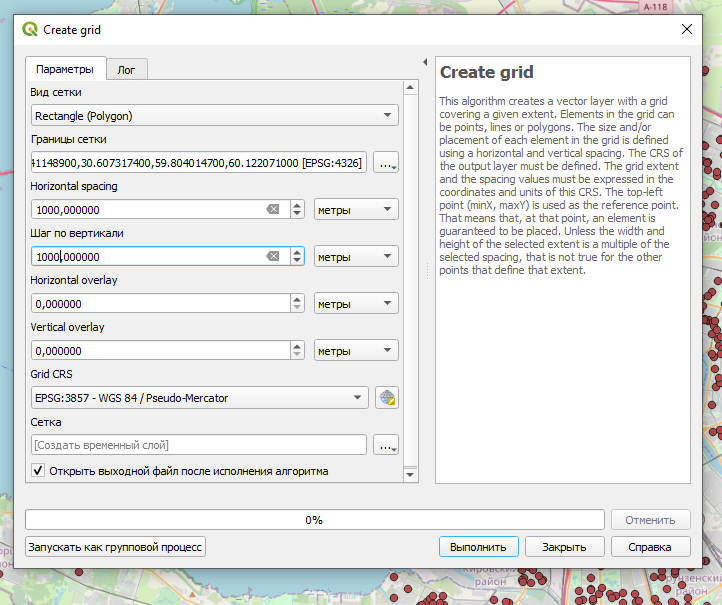
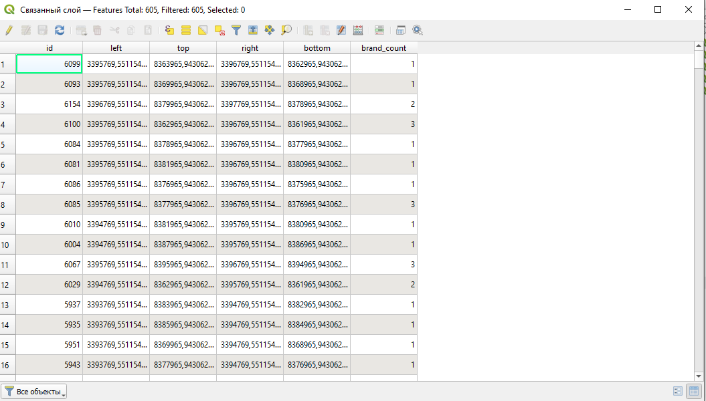
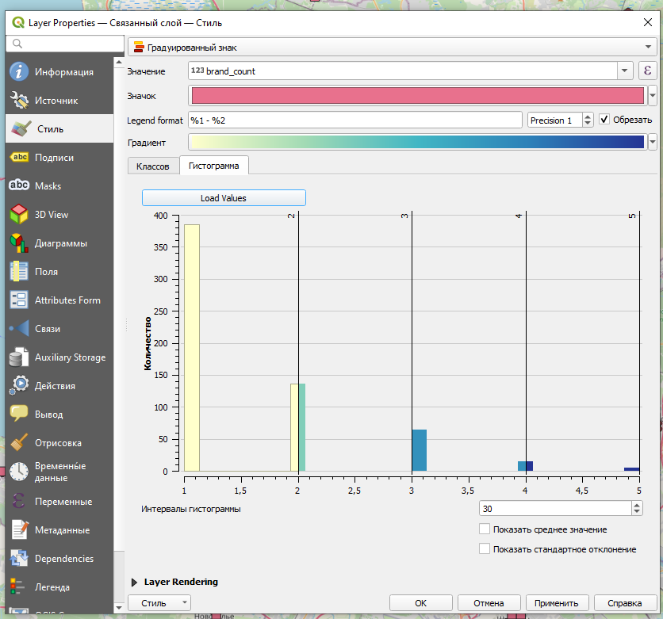
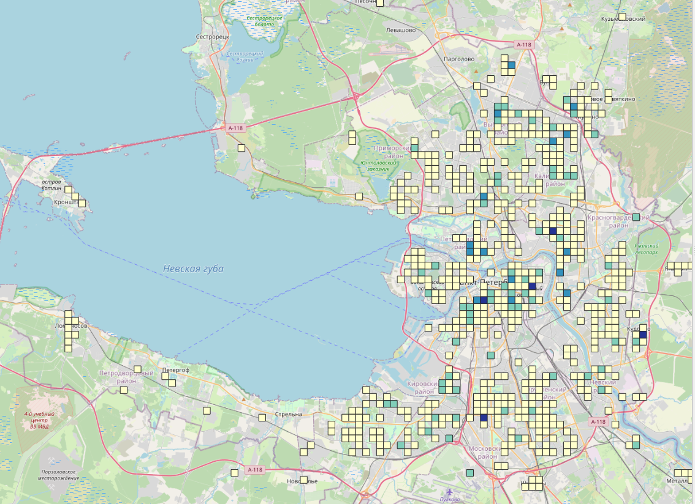
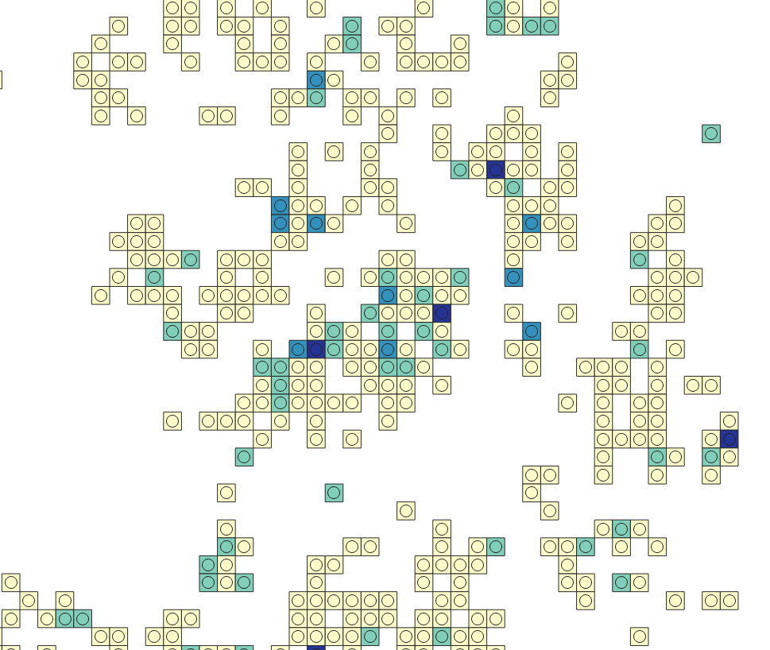
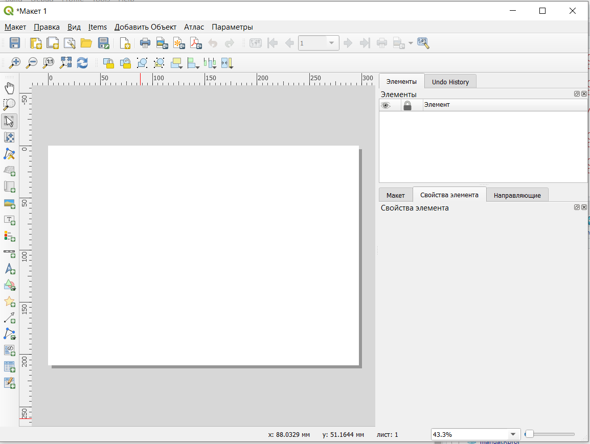
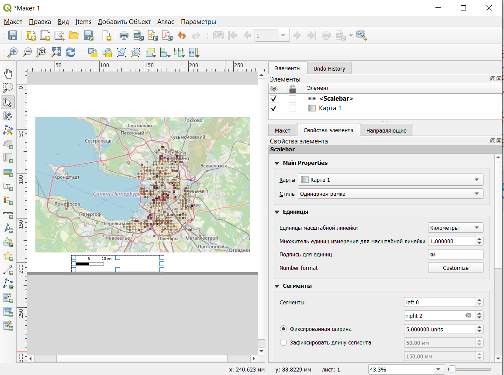
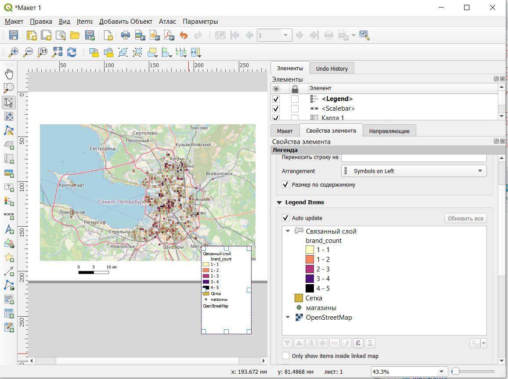
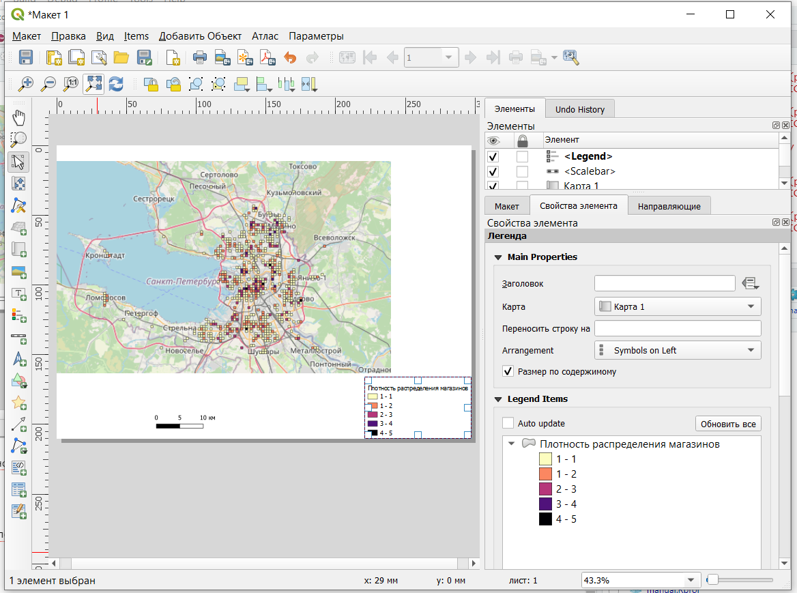

# Подсчет плотности объектов по сетке {#grid}

## Построение сетки

Построим карту плотности распределения объектов по сетке. Для этого нужно будет сначала включить панель инструментов анализа либо через строку меню **Вид ⤑Панели⤑ Инструменты анализа**, либо **Анализ данных ⤑Панель инструментов**.

Панель должна появиться в правой части окна программы.

Для начала создадим сетку с помощью инструмента *Create grid*.

После этого нужно задать параметры сетки.

Сетка может быть создана в виде точек, линий, прямоугольников, шестиугольников и ромбов. Наиболее распространено применение прямоугольной/квадратной сетки и сетки правильный шестиугольников.

Границы сетки лучше делать по границам того, слоя, который будет впоследствии агрегироваться по этой сетке.

> Важно помнить, что выбор размера ячейки сетки является очень важным: если ячейки будут слишком большие, то данные будут чересчур обобщенными, если ячейки будут слишком маленькими, то результат получится слишком дробным.

> Также следует помнить, что если вы не сохраните временные файлы, полученные в результате выполнения операции, они будут существовать только в течение текущего сеанса работы. Файлы можно сохранять сразу при задании параметров операции, либо после с помощью команды Экспорт или Сохранить на диск контекстного меню слоя.

В результате будет получена сетка квадратов

## Подсчет количества объектов

Для того, чтобы посчитать число объектов, попадающих в каждую ячейку сетки, нужно воспользоваться функцией *Пространственное соединение (summary)*.

Операция пространтсвенного соединения необходима для того, чтобы присоединить атрибуты объектов одного слоя к объектам другого слоя с учетом взаимного расположения объектов. Например, присвоить адреса домов объектам, расположенным внутри этих домов.

*Пространственное соединение (summary) (*в более новых версиях может называться *Присоединить атрибуты по пространственному положению (сводка)*)не просто присоединяет атрибуты, но еще и подсчитывает статистические показатели по исходным атрибутам.

Сначала нужно выбрать исходный слой (тот слой, которому будем приписывать новые атрибуты) и связанный слой (из которого эти атрибуты будут извлекаться), а также геометрический предикат (как объекты разных слоев расположены относительно друг друга).

В нашем случае в качестве геометрического предиката выступает *contains*, потому что ячейки сетки содержат в себе точки с магазинами.

Далее выбираем поля для суммирования. Если не будет выбрано ни одно поле, то будут взяты все атрибуты из связанного слоя. В нашем случае нам достаточно будет атрибута *brand*.

Далее выбираем резюме для расчета. Если не указать конкретный тип показателя, то программа будет рассчитывать все возможные показатели. Так как мы рассчитываем количество точек, то резюме для расчета нужно выбрать *count*.

Параметр *Отменить записи, которые не могут быть объединены* позволяет удалить те объекты исходного слоя, к которым не нашлось подходящих объектов связанного слоя.

Связанный слой лучше сохранить в файл.

Результат соединения (с включенным параметром *Отменить записи, которые не могут быть объединены*).

Таблица атрибутов полученного слоя

Поля *id, left, top, right, bottom* были созданы при изначальном построении сетки, а в поле *brand_count* у нас содержится посчитанное число точек, попадающих в соотвествующую ячейку.

Далее мы можем настроить цвет ячейки в зависимости от числа точек.

Для этого в настройках стиля слоя нужно выбрать ***Градуированный знак***, потом Значение по колонке *brand_count*.

Градиент можно выбрать из предложенных имеющихся или создать самостоятельно.

Для того, чтобы появилось разделение объектов не группы, нужно нажать кнопку *Классифицировать*.

Для классификации можно менять тип разбивки на группы (*Мода*) и число классов. Самые широко применяемые методы классификации -- *естественные интервалы Natural breaks* (создают группы так, чтобы разница между ними была максимальной), *равные интервалы* (весь интервал изменения показателя делится на равные отрезки) и *равное количество (квантиль)* (при этом типе классификации во всех группах будет одинаковое количество объектов).

Чтобы лучше понять, как осуществилась разбивка на группы, можно перейти во вкладку *Гистограмма* и нажать *Load values*. После этого будет построен график распределения объектов  по величине показателя и показана разбивка на группы.

Полученная в результате карта

## Стилизация слоя

Полученную карту мы стилизовали *«в стиле Lego»*.

Чтобы это сделать сначала нужно построить центроиды для квадратов сетки (функция *Центроиды* в панели инструментов анализа), потом этим центроидам задать те же самые настройки цвета, что и квадратам сетки.

Настроим цвета и размеры символов

Добавим "тень". Для этого нужно продублировать слой центроидов, сделать их черного или темно-серого цвета и настроить небольшое смещение.

## Оформление карты

Для того, чтобы оформить карту для печати, отчета или документации используют макеты. Макеты являются частью проекта.

Создание макета осуществляется из строки меню **Проект⤑Создать макет**. Имя макета можно задать самостоятельно или оно будет задано автоматически по умолчанию.

По умолчанию макет создается на листе формата А4 в альбомной ориентации, формат и ориентацию листа можно заменить в параметрах листа.

Слева в окне создания макета расположена панель добавления элементов, справа - перечень элементов и настройки конкретных элементов.

Для того, чтобы добавить на макет карту, нужно выбрать инструмент *Добавить карта*, щелкнуть на участок на листе, куда карту нужно добавить. В карте отображаются те же слои, которые являются видимыми в проекте, при отключении/включении слоев изображение на макете будет меняться. Чтобы этого не происходило, нужно заблокировать слои в настройках элемента карты.

Для карты можно настроить нужный масштаб, угол поворота при необходимости и систему координат.

Другими важными элементами оформления карты являются масштабная линейка и легенда. Эти элементы добавляются соответствующими кнопками на панели добавления элементов и далее настраиваются по необходимости.

В масштабной линейке может быть настроен тип линейки, размер и число отрезков на линейке. Важно помнить, ч то размер отрезков может быть задан как в единицах измерения карты (*Фиксированная ширина*), так и в единицах измерения листа (*Зафиксировать длину сегмента*).

Легенда добавляется по умолчанию с полным перечнем слоев проекта и с теми же названиями как в проекте.

При необходимости можно отключить автоматическое обновление легенды и скорректировать названия слоев и их перечень в легенде.

Готовую карту можно экспортировать для печати в формат изображения или pdf.
