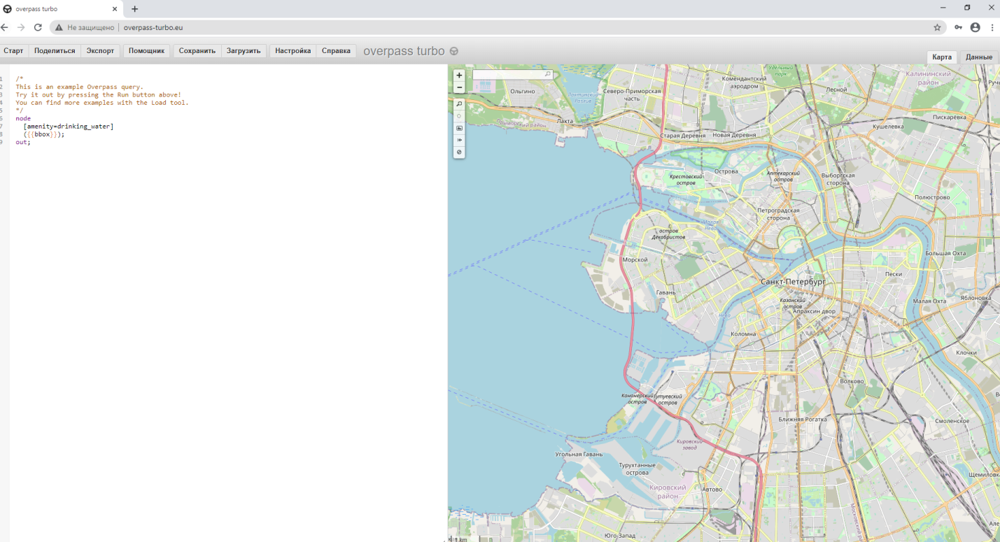
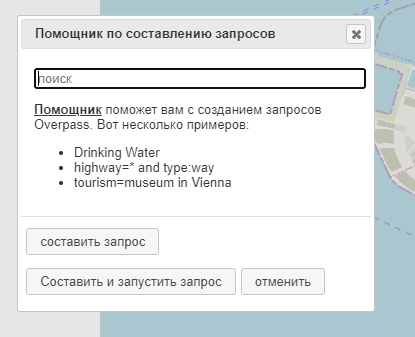
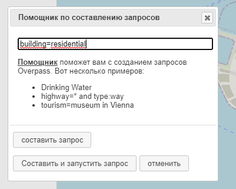
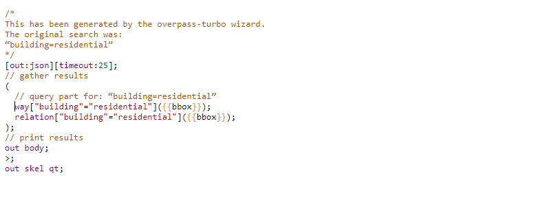
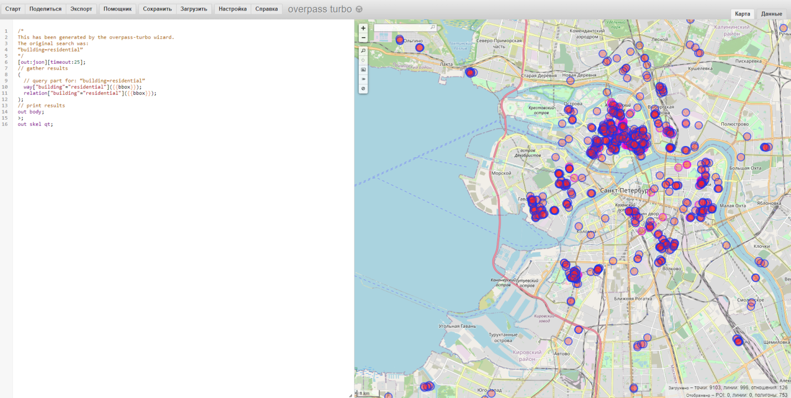
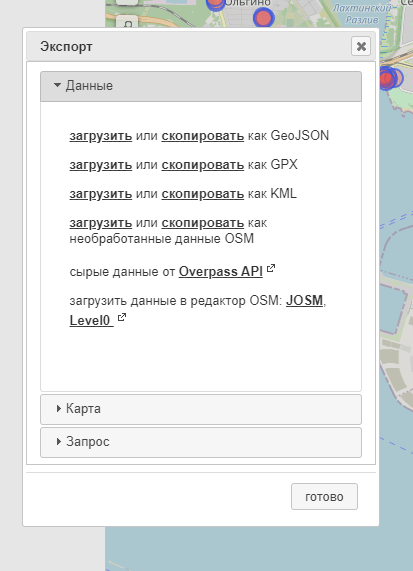
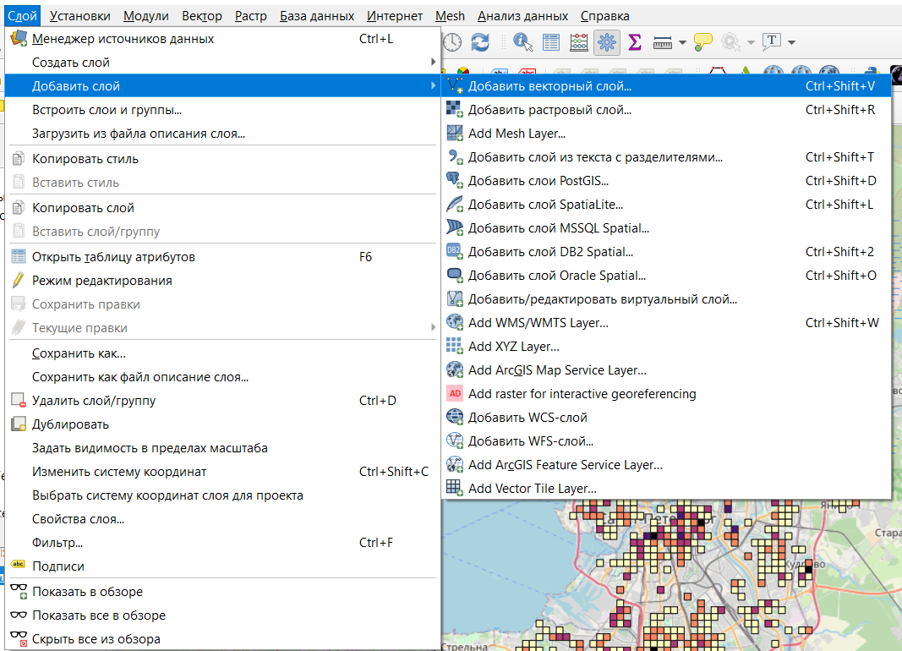
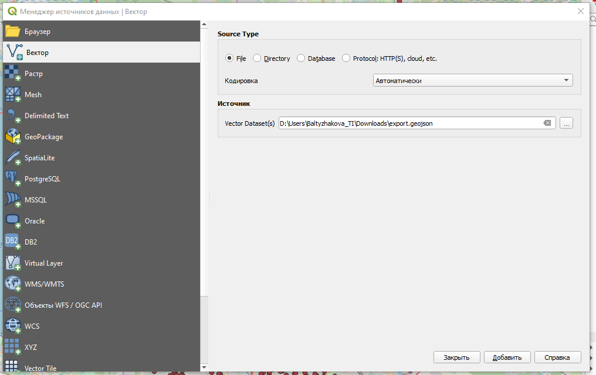

# Загрузка данных через сервис overpass-turbo

**OpenStreetMap (OSM)** --- проект, который создаёт и предоставляет свободные географические данные, дает возможность создавать карты любому пользователю. Каждый желающий может поучаствовать в проекте (загружать свои треки на сервер, дорисовывать общедоступную карту по спутниковым снимкам Bing, MapBox, DigitalGlobe (весь мир), IRS (запад России), SPOT4 (восток России) и SPOT (Белоруссия) от Космоснимки.ру, ASTER (Россия), OrbView-3 и другими) и использовать эти карты совершенно свободно, и бесплатно в отличие от многих других карт, даже бесплатных, свободное использование которых ограничено.

Карты этого проекта очень широко используются как в некоммерческих целях, например, для исследовательских проектов, так и для коммерческих проектов, например, создания навигационных приложений. Один из самых простых способов скачивания пространственных данных с OSM - это использование сервиса <http://overpass-turbo.eu/>.

Подробная информация о сервисе [[https://wiki.openstreetmap.org/wiki/Overpass_turbo]{.ul}](https://wiki.openstreetmap.org/wiki/Overpass_turbo)

Подробная информация о том, какие объекты как [обозначаются в OpenStreetMap](https://wiki.openstreetmap.org/wiki/RU:%D0%9E%D0%B1%D1%8A%D0%B5%D0%BA%D1%82%D1%8B_%D0%BA%D0%B0%D1%80%D1%82%D1%8B)

В левой части окна будет отображаться выполняемый запрос, а в правой результаты этого запроса. По умолчанию поиск осуществляется в той области, которая отображается в правой части окна (это можно скорректировать более сложными запросами, см. справку о сервисе).

Для составления запросов используется помощник

Мы производили поиск жилых зданий, они ищутся по запросу *building=residential*. Поиск осуществляется в той области, которая видна в правой части окна, поэтому перед выполнением запроса нужно найти нужную часть города (можно взять один район или несколько кварталов Санкт-Петербурга).

Запрос у вас должен получиться примерно такой (строчку, начинающуюся с node можно убрать вручную)

После нажатия кнопки *Старт* запрос будет выполнен и результаты отобразятся в правой части окна.

Полученные объекты можно экспортировать в векторный формат данных geojson для дальнейшей работы в QGIS (кнопка Экспорт, загрузить как GeoJSON)

Полученный файл можно открыть в QGIS (в строке меню *Слой -- Добавить слой -- Добавить векторный слой*).

В результате объекты должны появиться на вашей карте и в списке слоев.
