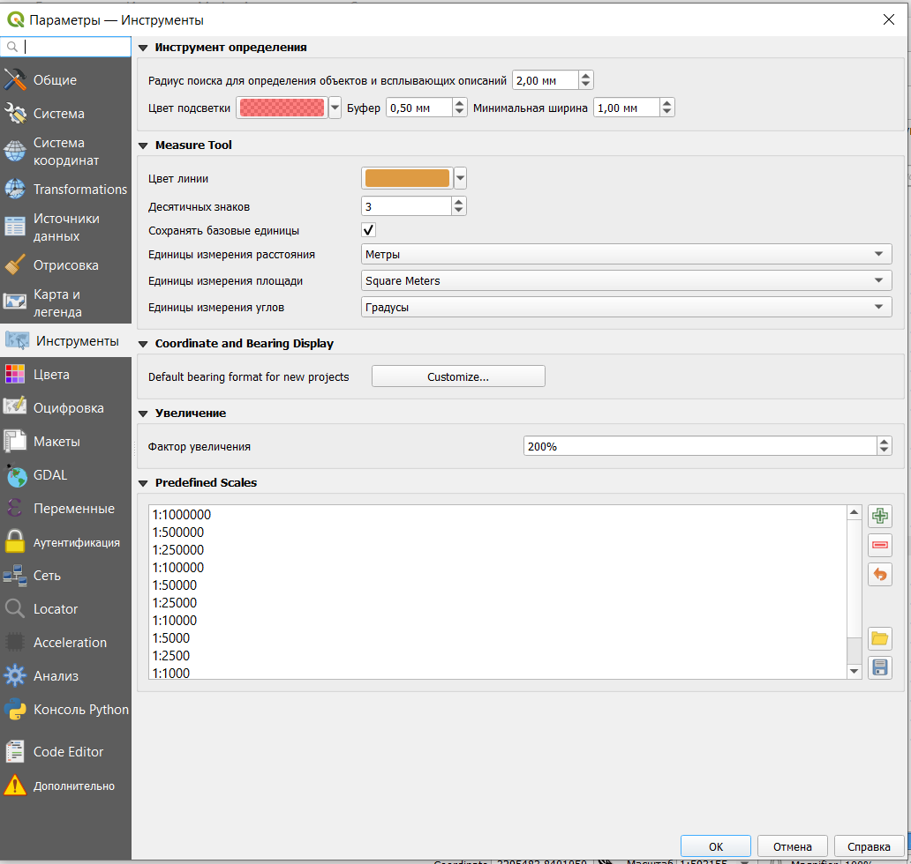
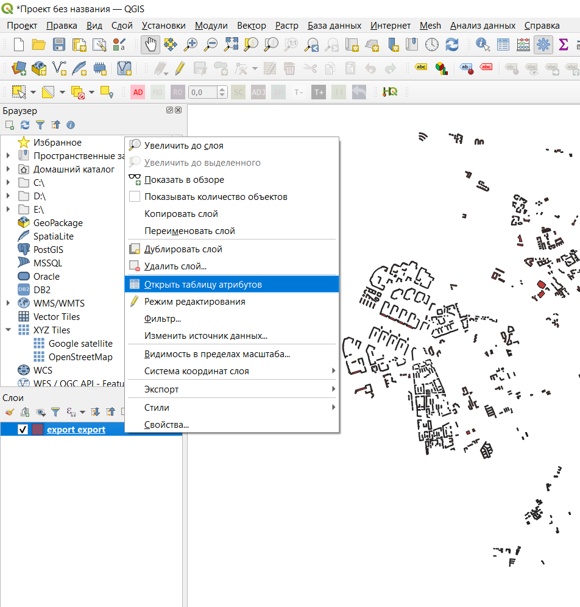
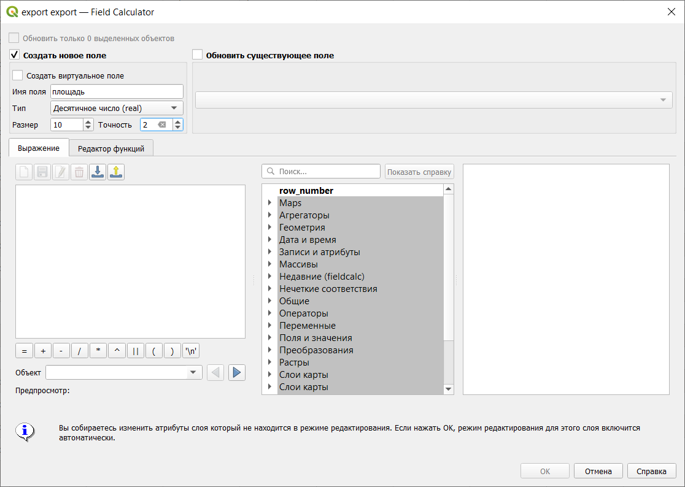
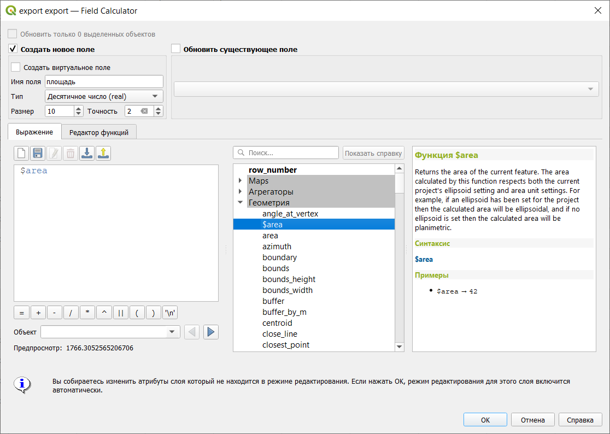

# Определение площади и периметра объектов

Определить площадь и периметр площадных объектов можно с помощью функции добавления геометрических параметров объектов к атрибутивной таблице или с помощью Калькулятора полей. Второй метод предпочтительнее, потому что меньше зависит от параметров системы координат.

Перед тем, как считать площадь нужно проверить единицы измерения, в которых будут проводиться расчеты. В строке меню нужно открыть настройки программы: Установки - Параметры. В открывшемся окне, нужно открыть Инструменты, где будут настройки инструментов измерения (Measure tools), в которых по умолчанию установлены единицы измерения расстояния - метры и единицы измерения - квадратные метры. При необходимости можно установить нужные единицы измерения.

Если единицы измерения установлены правильные, то можно переходить к определению площади. Для этого нужно открыть таблицу атрибутов слоя.

В таблице атрибутов нужно запустить Калькулятор полей (четвертый справа значок на панели инструментов).

Далее нужно выбрать хотите ли вы записывать результат в новую колонку (поле) или внести в существующую. Мы запишем результаты в новое поле, для которого обязательно нужно указать имя и тип данных. Тип данных в данном случае нужен десятичное число с точностью (числом знаков после запятой) 2.

В нижней части калькулятора слева окно, в котором будет отображаться выражение, по которому осуществляются расчеты, посередине приведены все функции, которые можно использовать при расчетах, а справа - краткая справка по выбранной функции.

Для определения площади нужна функция **\$area**, входящая в группу Геометрия.

После нажатия кнопки ОК, окно Калькулятора закроется, останется только окно таблицы атрибутов, в котором создана новая колонка с заданным именем и внесенными в нее значениями площади объектов.

Периметра рассчитывается аналогично, но с помощью функции **\$perimeter**.

Использования Калькулятора полей этим, конечно, не ограничивается: с его помощью можно осуществлять различные вычисления между атрибутами ваших объектов.
