# Построение буферных зон и оверлейные операции

## Буферные зоны

Буферизация обычно создает две области: одна в пределах  указанного расстояния от выбранного объекта реального мира, другая - вне. Область, которая находится в пределах указанного расстояния называется буферная зона.

С помощью буферных зон может осуществляться построение радиусов обслуживания определенных объектов, радиусов распространения отдельных явлений, границ зон с особыми условиями использования территорий.

Для создания буферной зоны необходимо убедиться, что проекция слоя позволяет измерение длин в метрической системе измерений, то есть в метрах. При необходимости слой нужно либо перепроецировать одноименным инструментом из панели инструментов анализа, либо просто пересохранить из контекстного меню слоя в нужной проекции командой *Сохранить как*.

Предположим, что нам нужно определить, какие дома обслуживаются магазинами, а какие нет. Установим радиус обслуживания магазинов 150 метров.

В нашем случае мы строим буферы вокруг магазинов, для которых система координат подразумевает измерения  в градусах, поэтому размер буфера мы сможем задать только в градусах.

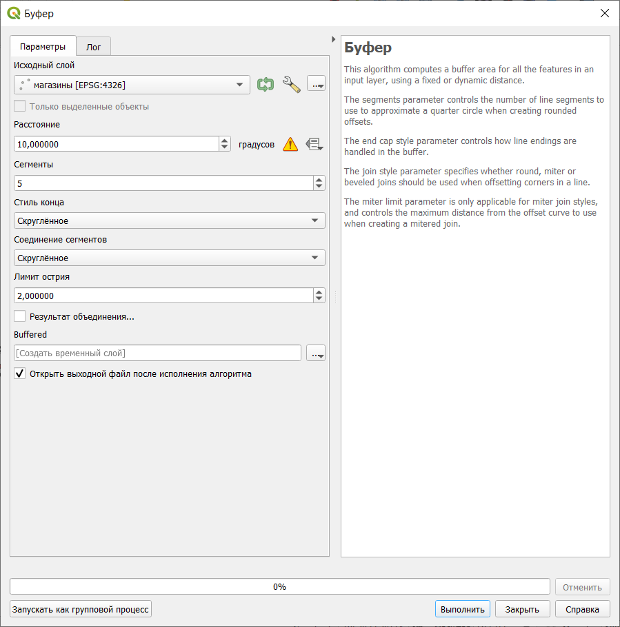

Чтобы задавать размер буфера в метрах, нам нужно сначала перепроецировать исходный слой с помощью инструмента *Перепроецировать слой*. В качестве целевой системы координат можно выбрать системы `EPSG:3857`, результаты лучше сохранить в файл.

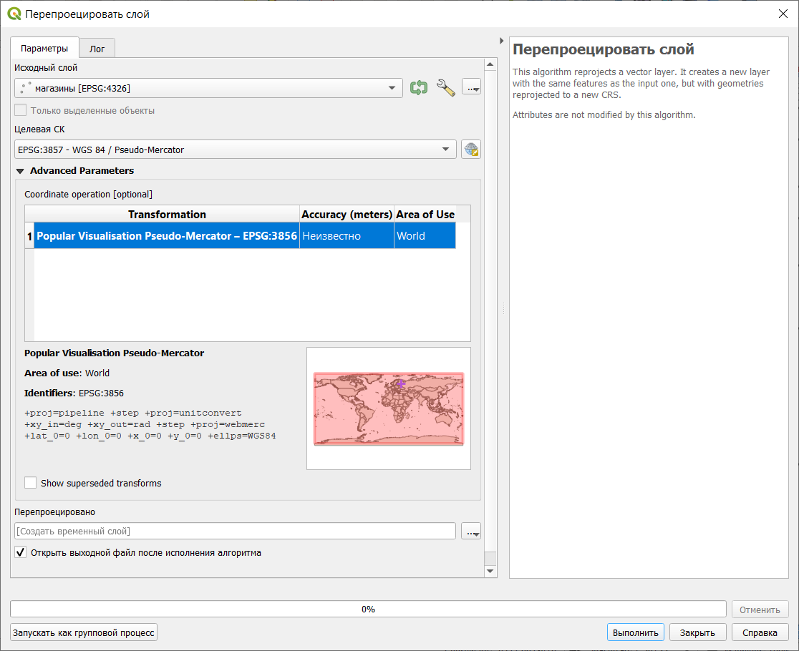

Новый перепроецированный слой будет отличаться от исходного только системой координат.

Далее мы можем создать буферы размером 150 метров для магазинов на основе перепроецированного слоя (результаты лучше тоже сохранить в файл).

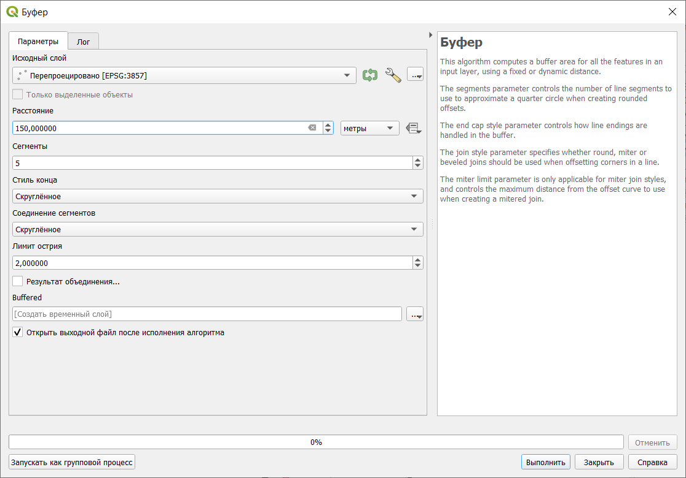

В результате должны получиться круги заданного радиуса вокруг магазинов.

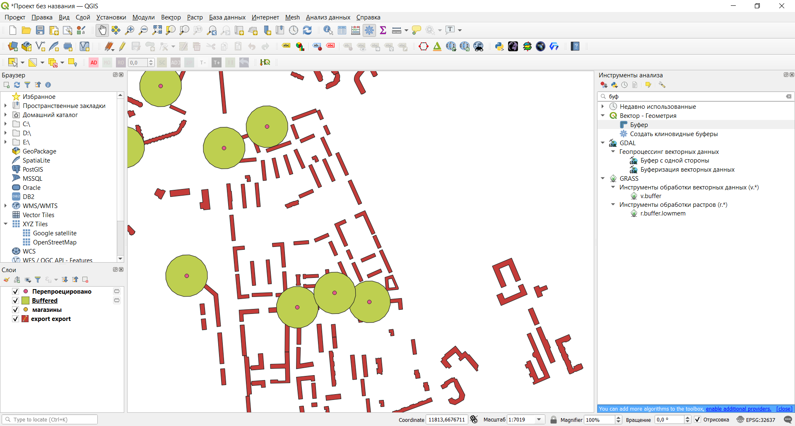

## Поиск объектов, попадающих в радиус обслуживания

Далее мы можем осуществить поиск домов, которые попадают в заданные области обслуживания.

Для поиска объектов есть группа инструментов *Вектор-Выбор*.

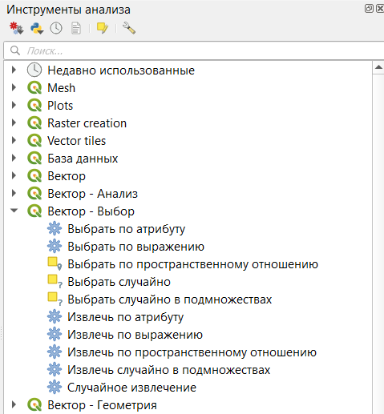

Часть инструментов в ней начинается со слова Выбрать, а часть - Извлечь. Разница между ними в том, что в первом случае объекты просто выделяются в исходном слое, а во втором - объекты, соответствующие заданным условия, извлекаются в новый слой.

Краткое описания инструментов:

-   выбрать\\извлечь по атрибуту - поиск объектов по значению одного из атрибутов;

-   выбрать\\извлечь по выражению - поиск объектов по значениям нескольких атрибутов одновременно;

-   выбрать\\извлечь по пространственному отношению - поиск объектов по их расположению относительно объектов другого слоя;

-   выбрать\\извлечь случайно - случайная выборка объектов из слоя (заданного числа объектов или заданного процента объектов);

-   выбрать\\извлечь случайно в подмножествах - сначала слой разбивается по категориям по одному из атрибутов, потом из каждой категории извлекается заданное число или заданный процент объектов.

Нам  нужно определить, какие здания попадаются в буферные зоны, поэтому нужно воспользоваться выбрать\\извлечь по пространственному отношению.

Для выбора объектов нужно сначала указать в каком слое осуществляется поиск (слой со зданиями), геометрический оператор (как объекты расположены относительно объектов другого слоя) и слой для сравнения (буферные зоны). Геометрические операторы в данном случае лучше выбирать *Пересекает* и *В пределах*.

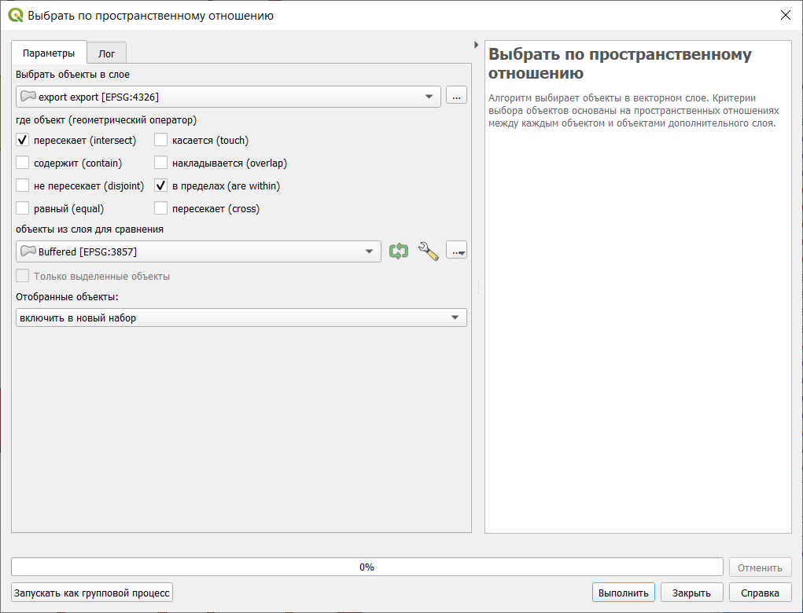

В результате выбранные объекты будут выделены желтым цветом на карте.

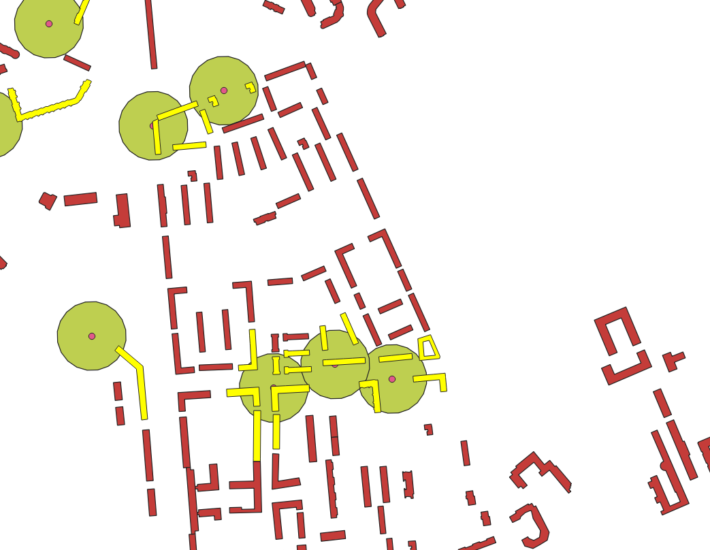

Функция Извлечь по пространственному отношению работает аналогично с почти теми же характеристиками, кроме того, что вы можете выбрать сохранить результаты во временный слой или в файл.

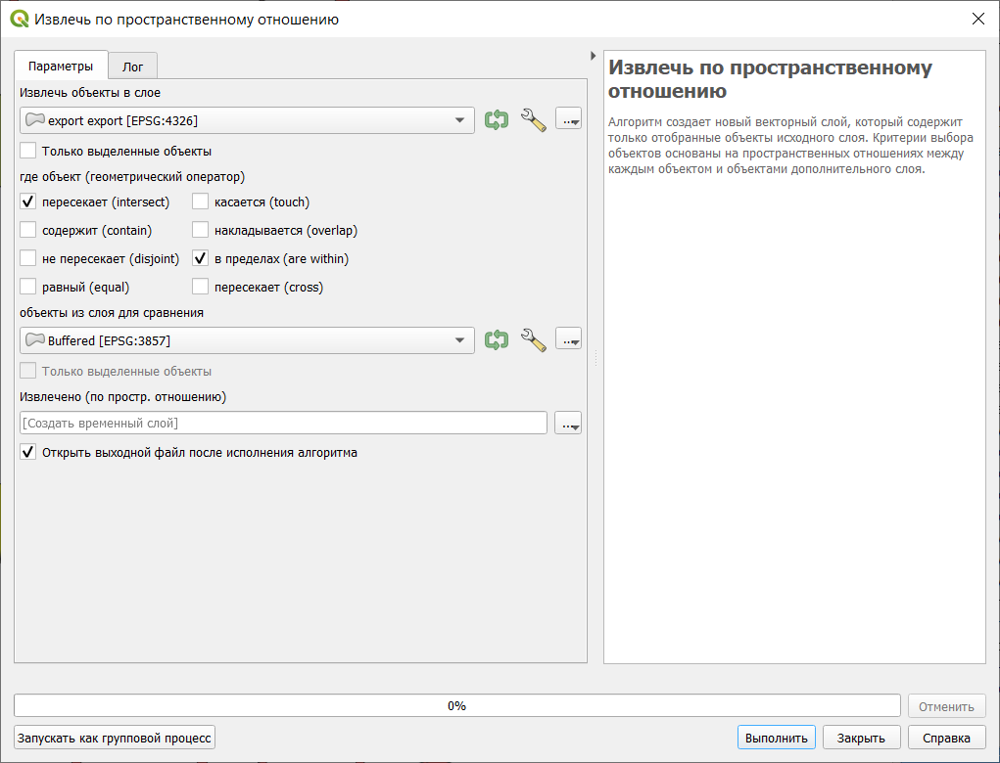

В результате вы получите новый слой, в котором будут содержаться только те объекты, которые соответствуют заданному условию.

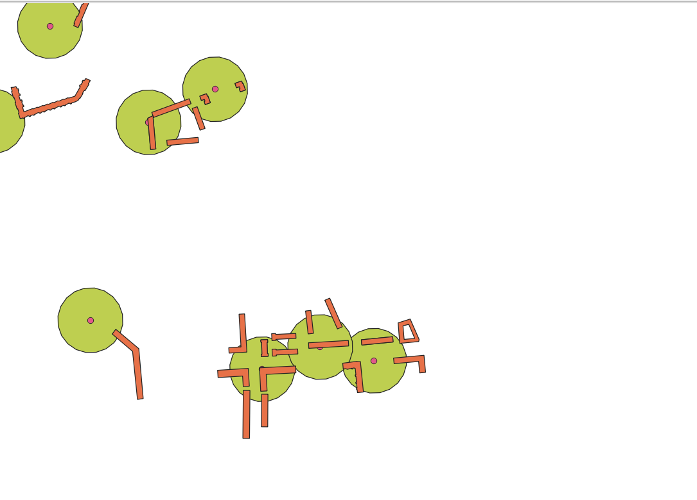

## Оверлейные операции

Оверлейные операции являются одним из основных способов пространственного анализа. Название этих операций произошло от слова overlay - наложение. Суть оверлейных операций состоит в том, что два слоя накладываются друг на друга, после чего осуществляется какая-то операция (разность, обрезка и т.п.) в результате чего создается результирующий новый слой.

В QGIS можно выполнить следующие оверлейные операции: *Обрезать, Пересечение, Объединение, Симметричная разность, Разность*.

Проиллюстрирую работу различных операций на основе буферных зон вокруг магазинов (500 м) и квадратов сетки.

Исходные слои

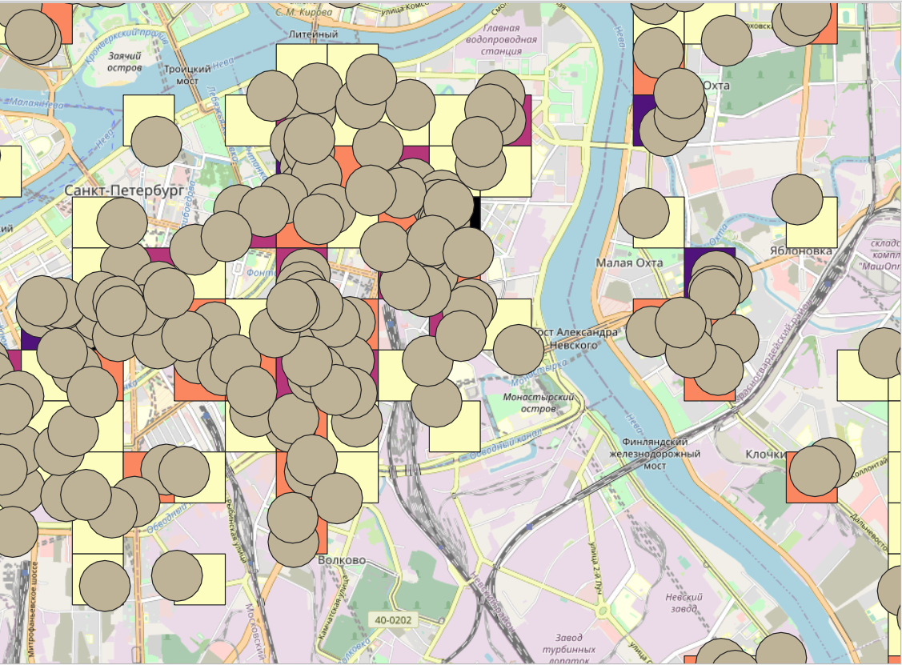

При выполнении команды *Пересечение* в выходном слое содержатся только участки, в которых оба слоя пересекаются.

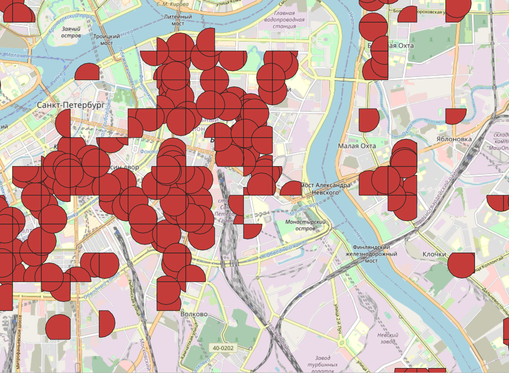

Команда *Объединение* совмещает слои таким образом, что в выходном слое содержатся как участки пересечения, так и участки, принадлежащие только одному из слоев.

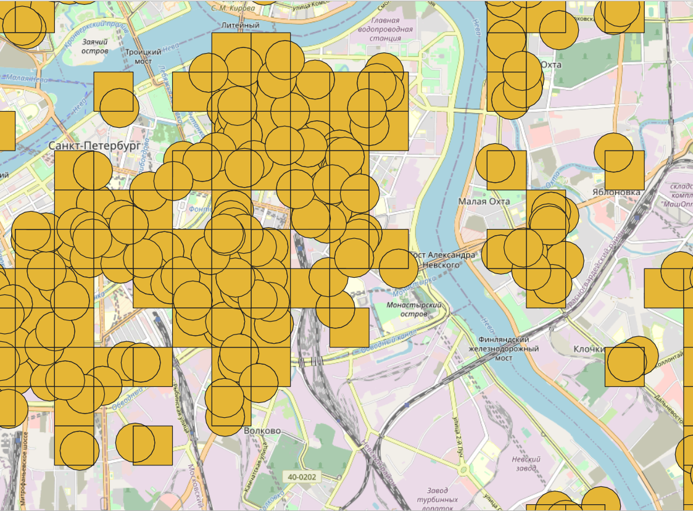

Команда *Симметричная разность* оставляет в выходном слое только те участки, в которых исходные слои не пересекаются.

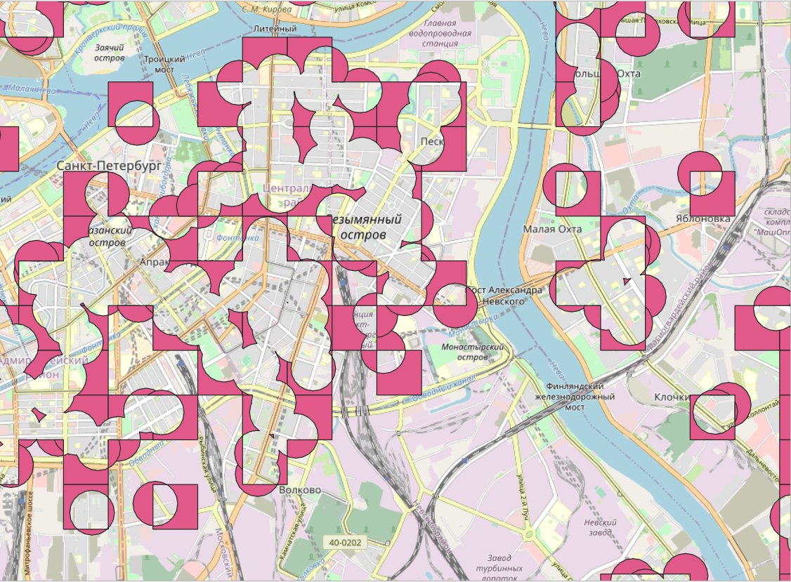

Команда *Обрезать* совмещает слои таким образом, что в выходном слое содержатся только те участки, которые пересекаются со слоем отсечения. Принципиальное отличие этой команды от пересечения в том, что сохраняется исходная геометрия объектов, тогда как при пересечении исходные объекты дополнительно рассекаются объектами накладывающегося слоя.

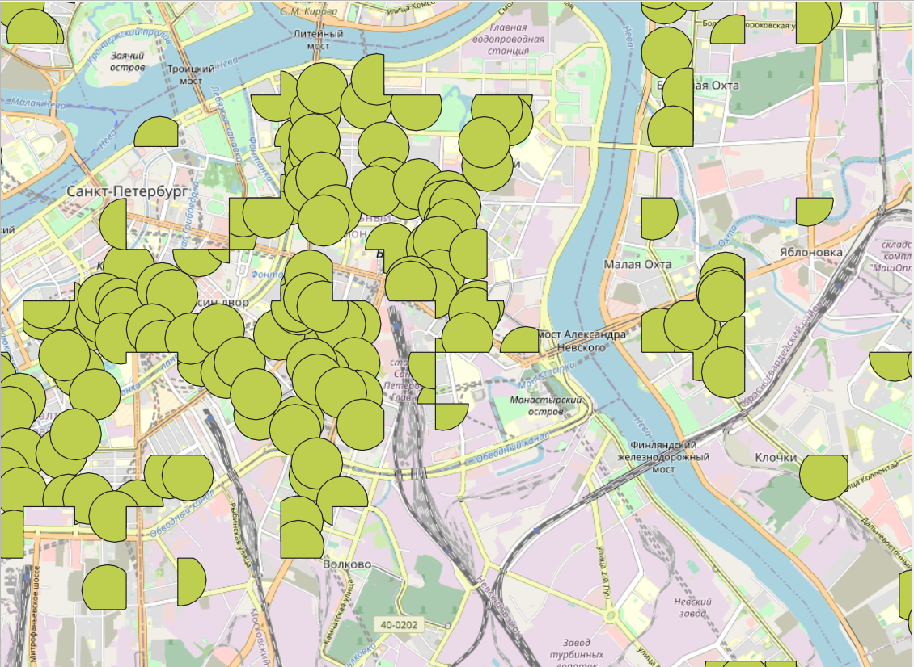

Команда *Разность* совмещает слои таким образом, что в выходном слое содержатся только те участки, которые не пересекаются со слоем отсечения.

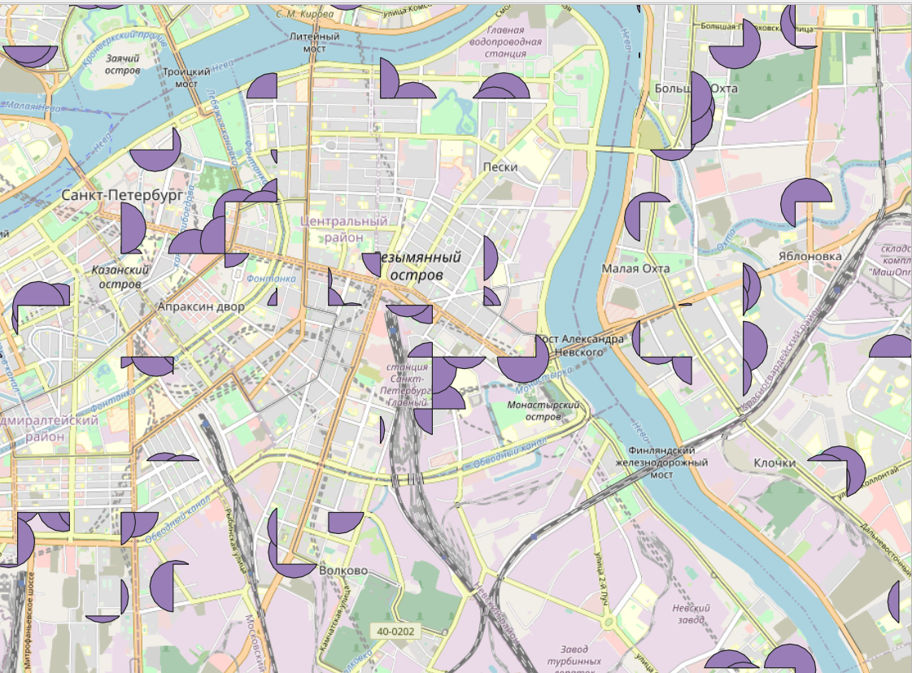

> Важно помнить, что результат оверлейных операций зависит от того, какой слой будет указан первым (будет исходным), а какой вторым (будет накладываться). В приведенных примерах везде слой буферных зон был исходным, а накладывался слой с сеткой.

Все оверлейные операции находятся с панели инструментов в группе Вектор-Оверлей. Подробнее с примерами можно прочесть [[https://docs.qgis.org/3.10/ru/docs/user_manual/processing_algs/qgis/vectoroverlay.html]{.ul}](https://docs.qgis.org/3.10/ru/docs/user_manual/processing_algs/qgis/vectoroverlay.html)
