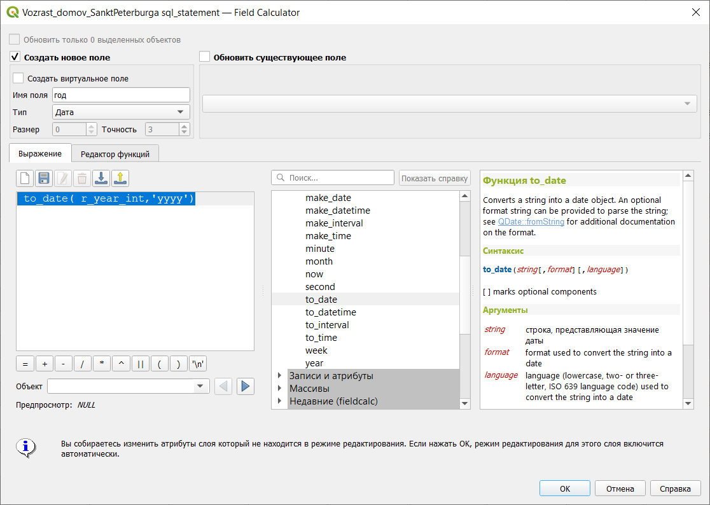
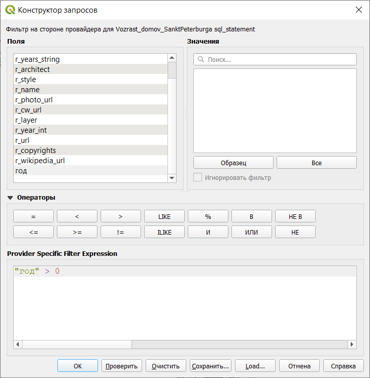
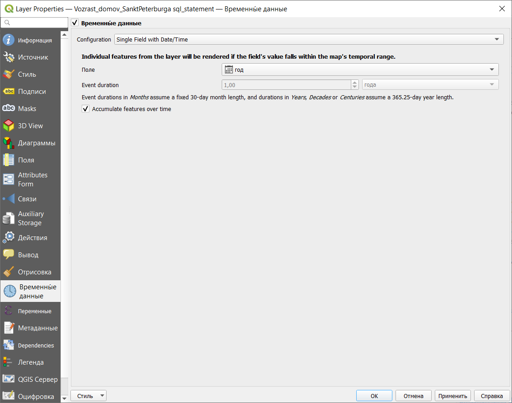
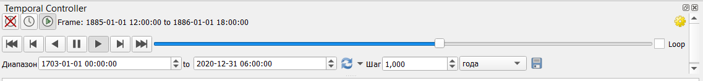

# Работа со слоями, в которых есть временная составляющая

Кроме обычных пространственных данных QGIS позволяет работать с данными, в которых есть сведения о дате и времени.

Это задание лучше сделать в отдельном пустом проекте. Исходные данные нужно скачать с сайта [[https://how-old-is-this.house/]{.ul}](https://how-old-is-this.house/) в разделе Данные (для любого из городов). Скачанные данные нужно обязательно распаковать, а потом открыть файл (в строке меню *Слой -- Добавить слой -- Добавить векторный слой*).

В этом слое есть два поля с данными о годе постройки: r_year_string (текстовое поле), r_year_int (целое число). Но для нас обязательно нужно поле с типом данных Дата. Для этого сделаем новую колонку из имеющихся с помощью калькулятора полей.

Для этого воспользуемся функцией  to_date, которая преобразует данные в формат даты. В качестве параметров здесь обязательно нужно указать, какое поле преобразуется и в какой формат даты. В нашем случае выражение будет выглядеть так:  **to_date( r_year_int,'yyyy')**

В результате в таблице атрибутов будет добавлено поле, в котором даты будут приведены примерно так: 1991-01-01 (первое января в нашем случае, потому что день и месяц неизвестны).

Но не для всех домов у нас есть год постройки, поэтому отфильтруем только те дома, для которых год известен.

Фильтр для слоя открывается из контекстного меню, которое вызывается нажатием правой кнопки мыши на название слоя. Так как слой находится в режиме редактирования, фильтр неактивен, поэтому сначала в контекстном меню нужно сначала нажать Режим редактирования, чтобы его отключить (изменения нужно сохранить).

Далее нужно поменять настройки слоя, чтобы он распознавался как слой, содержащий характеристики времени. Для этого нужно открыть Свойства слоя, параметр Временные данные.

Для начала нужно поставить галочку напротив слов Временные данные, потом выбрать тип данных (configuration), в нашем случае - это поле с датой\\временем (single field with date\\time), после этого нужно выбрать поле, содержащее дату, задать продолжительность событий (event duration) в 1 год и указать, что объекты со временем накапливаются в слое (accumulate features over time).

После применения свойств напротив названия слоя должны быть два значка: воронка (фильтр) и циферблат (временные данные). Далее нужно запустить Temporal controller - панель для работы с временными данными. Открыть панель можно через строку меню: *Вид - Панели - Temporal controller*.

После этого появится серая горизонтальная панель, в которой можно настроить анимированное отображение данных по времени.

