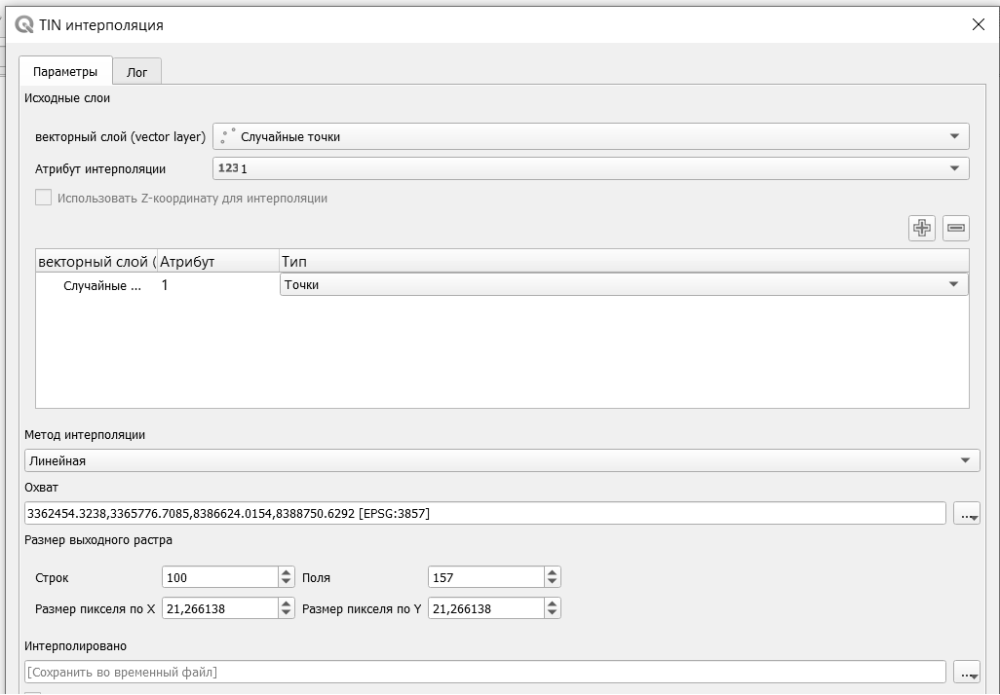
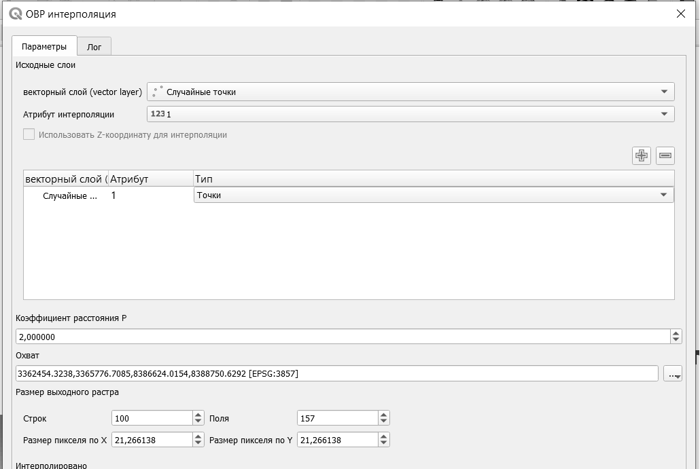

# Интерполяция

Интерполяция - это восстановление значений непрерывной величины по имеющимся дискретным значениям. Например, определены высоты в определенных точках, по которым осуществляется интерполяция, для того, чтобы получить значения высот на всех рассматриваемой местности.

Наиболее распространенными и широко применяемыми являются два метода интерполяции: *TIN-интерполяция (Triangulated Irregular Network) и метод обратно взвешенных расстояний*.

В первом методе на основе исходных точек сначала строится сеть треугольников - триангуляция Делоне, в которой соединяются между собой соседние точки. Далее по полученным треугольникам осуществляется интерполяция.

Главным недостатком этого метода является то, что в результате получается негладкая поверхность. Однако именно этот метод, как правило, рекомендуют применять для рельефа и высот, так как в этом случае исходны точки играют роль характерных точек рельефа.

В методе обратно взвешенных расстояний всем точкам присваиваются веса в зависимости от того, как далеко они расположены от той точки, для которой выполняется интерполяция. Принимается, что далеко расположенные точки мало влияют друг на лруга и на значения в искомой точке, а близко расположенные - оказывают сильное влияние. Этот метод позволяет получить довольно гладкую результирующую поверхность и его рекомендуют применять для всех характеристик кроме рельефа.

В результате интерполяции получается растровое изображение, в каждой ячейке которого содержится значения интерполируемой величины.

Основными параметрами при TIN-интерполяции являются исходный слой, параметр интерполяции, охват слоя и параметры выходного растра.

Основными параметрами при интерполяции методов обратно взвешенных расстояний являются исходный слой, параметр интерполяции, охват слоя и параметры выходного растра, а также коэффициент расстояния, который влияет на присваиваемые веса точек. Чем больше величина коэффициента расстояния, тем более дискретные значения будут получены.

Полученный растр можно использовать для построения трехмерной поверхности.
