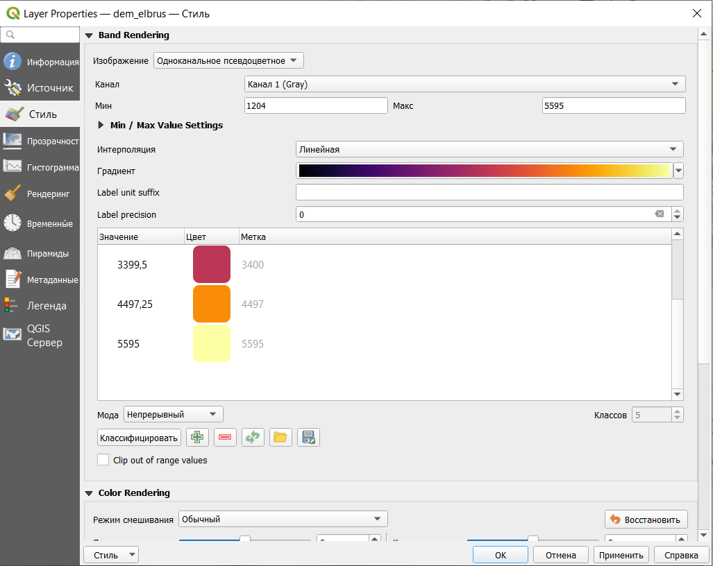
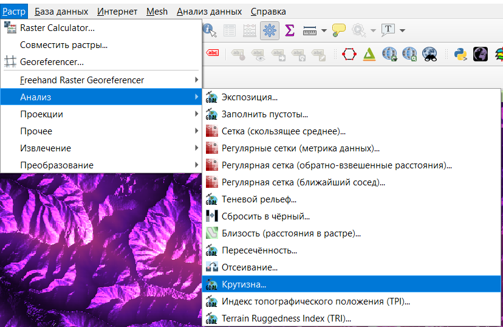

# Цифровые модели рельефа

## Морфометрический анализ рельефа

Цифровые модели рельефа, как правило, строят либо по результатам интерполяции, либо на основе открытых данных.

Самым распространенным источником данных о рельефе является цифровая модель рельефа SRTM (shuttle radar topographic mission). Эта цифровая модель была получена в 2000 году на основе спутниковой радарной съемки. Она охватывает планету между 54 градусами южной широты и 60 градусами северной широты. Подробнее на русском можно почитать про нее [здесь](https://gis-lab.info/qa/srtm.html)

Скачать данные SRTM можно на сайте Геологической службы США (<https://earthexplorer.usgs.gov/>) или с помощью плагина SRTM downloader.

Для примера и выполнения работы были скачаны данные для окрестностей Эльбруса. Они находятся [здесь](https://drive.google.com/file/d/1s57yc3rKQbZfFcM8TeWsI6t6HCc7412w/view?usp=sharing).

В каждой ячейке исходного растрового изображения содержится значение высоты.

Добавление растрового слоя осуществляется через строку меню **Слой - Добавить слой - Добавить растровый слой**.

В результате должно появиться изображение рельефа в оттенках серого цвета.

Это изображение можно сделать цветным, для этого нужно открыть свойства слоя. В настройках стиля нужно выбрать тип изображения *Одноканальное псевдоцветно*е.

Градиент можно создать самостоятельно с помощью редактора.

В результате будет получено изображение растра в цветах выбранного градиента.

С использованием такого растра может быть построена трехмерная поверхность, отображающая рельеф местности, а также выполнен ряд вычислений для морфометрического анализа рельефа. Для более наглядного отображения рельефа на карте рассчитывается теневой рельеф, который строится с использованием позиции источника направленного света.

В результате должно получиться что-то подобное.

Этот теневой рельеф можно использовать, чтобы добавить дополнительный объем подложке или исходному рельефу растра. Для этого нужно открыть свойства слоя с теневым рельефом и изменить режим смешивания на Добавление или Осветление (также можно поэкспериментировать с настройками яркости и контрастности).

Поверх исходного растра с рельефом получается подобный результат.

Рассчитаем крутизну склонов.

Так как на рассматриваемой местности довольно крутые склоны, лучше их считать в процентах, а не в градусах (Slope expressed as percent instead of degrees).

Результат определения крутизны склонов.

Это изображение мы также можем сделать цветным и наложить на него теневой рельеф для большего объема.

Определим экспозицию склонов - ориентацию по сторонам света.

Результат в цветном виде с наложенным поверх теневым рельефом.

Рассмотрим рельеф как трехмерную поверхность. Чтобы открыть трехмерный вид карты, нужно в строке меню выбрать **Вид- Новая 3D карта**. В данном случае была добалвена подложка со спутниковым изображением с теневым рельефом поверх.

Трехмерный вид открывается в отдельном окне программы, но если его повращать, то станет заметно, что карта все еще плоская. Чтобы поверхность стала трехмерной нужно нажать кнопку Configure... и выбрать тип DEM (raster layer), высота должна браться из исходного растра.

Полученная поверхность

## Создание горизонталей

Из растра со значениями высот могут быть извлечены горизонтали

Расстояние между изолиниями - это фактически высота сечения рельефа, то есть через сколько мы будем проводить горизонтали.

Полученные изолинии

Настроим горизонтали таким образом, чтобы каждая пятая была утолщенной, добавим подписи и настроим их так, чтобы они были "головой вверх".

Начнем с настройки толщины линий. Для этого в свойствах слоя выберем настройку толщины в зависимости от выражения.

Далее пропишем логическое выражение: **if("ELEV"%500=0,0.7,0.3)**. В этом выражении перед запятой прописано условие - высота горизонтали делится на 500 без остатка, потом толщина линии, если условие выполняется, и толщина, если условие не выполняется.

Результат

Добавим подписи.

Но при таком добавлении подписей, будут подписаны все горизонтали, а мы хотим подписать только утолщенные. Для этого нужно прописать выражение, подобное тому, что мы писали выше: **if("ELEV"%500=0,"ELEV","").**

Добавим белую обводку подписям, чтобы они не сливались с горизонталями

Сделаем так, чтобы они размещались на линии и изгибались в соответствии с ней.

И настроим подписи так, чтобы все они смотрели головой в сторону увеличения высоты.

В результате получим горизонтали, где каждая пятая будет утолщена и подписана головой в сторону увеличения.

